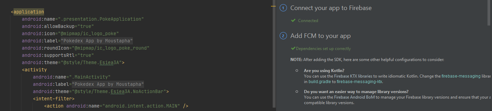

# PokedexMobileProject

<b> <U> Student: Moustapha SY Class 33 </U> </b>

<b>  <U> Description : </U> </b>

L'objectif de ce projet est de pouvoir faire en sorte de nous familiariser avec le langage KOTLIN, qui se rapproche du langage vu cette année JAVA. Les différents travaux pratiques nous ont permis de nous familiariser avec celui-ci et de comprendre l'aspect théorique accompagné de la pratique avec les != travaux.

Les différentes notions attendues du livrables sont les suivantes:

-Écran avec une liste d'éléments  
-Écran avec le détail d'un élément  
-Appel WebService à une API Rest  
-Stockage de données en cache  

<b> <U> Le contenu de mon livrable: </U> </b>

-Changement du logo de mon application pour rendre le Pokédex plus réaliste   
-Changement de la couleur de notre barre pour rester dans le thème du Pokédex  
-Écran avec une liste d'éléments dans notre contexte les élements font références aux Pokémons  
-Appel WebService  à une API (fichier correspondant PokeAPI)  
-Stockage des données utilisées en cache

Pour faciliter la recherche au sein du Pokédex j'ai rajouté un bouton recherche     
-Fonctionnalité de recherche    
-Fonctionnalité pour aider l'utilisateur en lui permettant de voir ce qu'il recherche("Looking for..")

Le Design Pattern MVVM   
-Différents cas gérer avec l'architecture MVVM

  
  
  
  
  
  
  
     
    
  Axes d'amélioration :     
L'application n'est pas encore à son potentiel maximale, je compte continuer à implémenter de nombreux pokémons durant les vacances d'été. Je suis quand même fier du résultat le sujet me parle beaucoup, je suis un grand passioné de l'univers Pokémon. Au début je voulais faire une app dédiée sur la NBA mais j'ai pas réussi à trouver une API qui correspondait bien à ce que je voulais j'essayerais de voir comment m'y prendre.
  
  <b> Attrapez-les tous ! </b>
  
